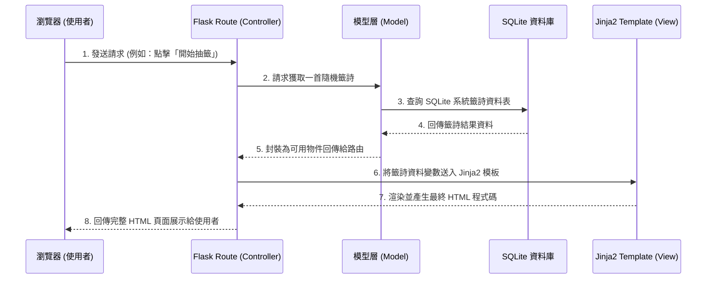

# 系統架構文件 (Architecture)：線上算命系統

## 1. 技術架構說明
本專案為一個無前後端分離的網頁應用程式 (Monolithic Web Application)，以確保開發速度且適合初期打造 MVP。

- **選用技術與原因**
  - **後端架構：Python + Flask**  
    Flask 是一個輕量級的網頁框架，開發速度快且彈性高，非常適合用來快速建立如本次的線上算命系統。
  - **前端頁面渲染：Jinja2 模板引擎**  
    Jinja2 與 Flask 整合度極高，可以直接在伺服器端將資料庫的結果（如抽出來的籤詩或登入狀態）動態帶入 HTML 中渲染，無須額外建置與維護龐大的前端 SPA (Single Page Application) 系統。
  - **資料庫：SQLite (預計透過 SQLAlchemy)**  
    對於開發初期的 MVP，SQLite 不需要額外建置資料庫伺服器，資料儲存在單一檔案 (`database.db`) 中，方便開發、測試與備份。

- **Flask MVC 模式說明**  
  雖然 Flask 是一個微型框架，但本專案將依循 MVC (Model-View-Controller) 的設計概念來組織程式碼：
  - **Model (資料模型)**：負責定義資料結構（如 使用者 User、籤詩 Fortune、捐獻紀錄 Donation）並與 SQLite 進行溝通。
  - **View (視圖)**：Jinja2 模板 (`.html` 檔案)，負責最終呈現給使用者的網頁畫面樣式，以及資料的展示（包含載入 CSS 樣式與 JS 動畫）。
  - **Controller (控制器/路由)**：Flask 的 `routes` 網址路由，負責接收瀏覽器發出的 HTTP 請求，向 Model 調用或儲存資料，最後再將資料傳遞給 View 來渲染。

## 2. 專案資料夾結構

以下為本專案建議的開發資料夾與檔案結構規劃：

```text
web_app_development/
├── app/                      ← 應用程式主目錄 (Flask App)
│   ├── __init__.py           ← 負責初始化 Flask 實例與各種套件 (如 SQLAlchemy)
│   ├── models/               ← 資料庫模型 (Models) 存放區
│   │   ├── __init__.py
│   │   ├── user.py           ← 使用者帳號相關資料表
│   │   ├── fortune.py        ← 籤詩庫與算命紀錄資料表
│   │   └── donation.py       ← 捐獻與香油錢紀錄表
│   ├── routes/               ← Flask 網址路由 (Controllers) 存放區
│   │   ├── __init__.py
│   │   ├── auth.py           ← 登入、註冊相關路由
│   │   ├── main.py           ← 首頁、線上抽籤與核心邏輯路由
│   │   └── profile.py        ← 使用者個人紀錄、捐獻紀錄路由
│   ├── templates/            ← HTML 模板檔案 (Views)
│   │   ├── base.html         ← 共用網頁排版 (包含 Navbar, Footer 跟基本的 head)
│   │   ├── index.html        ← 系統首頁
│   │   ├── auth/             ← 登入 / 註冊相關頁面模組
│   │   ├── fortune/          ← 抽籤動畫、算命結果顯示頁面模組
│   │   └── profile/          ← 個人主頁、紀錄顯示版面
│   └── static/               ← 靜態資源檔案
│       ├── css/              ← 網站樣式表 (客製化樣式設計)
│       ├── js/               ← 前端互動腳本 (例如：控制擲筊動畫邏輯)
│       └── images/           ← 籤筒、筊杯圖示、視覺設計等多媒體素材
├── instance/                 ← 本機特定環境檔案 (安全考量，不會進入版本控制)
│   └── database.db           ← SQLite 資料庫檔案
├── docs/                     ← 專案設計文件目錄
│   ├── PRD.md                ← 產品需求文件
│   └── ARCHITECTURE.md       ← 系統架構文件 (本文件)
├── requirements.txt          ← Python 套件相依清單
├── config.py                 ← 系統參數與環境變數設定檔
└── run.py                    ← 啟動 Flask 專案伺服器的入口檔案
```

## 3. 元件關係圖

以下圖示呈現了系統核心元件之間的資料流互動關係：



## 4. 關鍵設計決策

1. **採用 Blueprint (藍圖) 組織路由**
   - **原因**：為了避免所有的路由網址都擠在同一個檔案內導致難以維護，本專案依據業務邏輯拆分為不同的 Blueprint（例如 `auth`, `main`, `profile`），讓功能模組化，方便團隊同步開發。
   
2. **採用 SQLAlchemy 作為 ORM (物件關聯映射)**
   - **原因**：透過 ORM 不需要直接手寫大量原生 SQL 語法，增加了安全與開發速度。另外，若未來系統成長需要從 SQLite 遷移至大型資料庫系統（如 MySQL / PostgreSQL），程式碼幾乎不須要修改。
   
3. **密碼加密決策 (使用 Werkzeug.security)**
   - **原因**：遵循 PRD 中規定的安全考量，註冊之密碼絕對不可轉成明文儲存。Flask 底層的 `Werkzeug` 工具就內建了強度相當高的密碼雜湊模組 (`generate_password_hash`)，直接套用可快速強化安全性，不依賴額外套件。
   
4. **前端無須掛載複雜 SPA 框架**
   - **原因**：因為專案核心目標為快速打造 MVP 產品，引入 React 或 Vue 等框架需要額外耗費時間設定 API 及跨網域請求 (CORS)。藉由 Jinja2 渲染足以完成絕大多數的頁面，且「擲筊互動動畫」僅需少量原生 JavaScript 操作 DOM 即可實現。
   
5. **採用 Session 進行狀態管理**
   - **原因**：簡單且直接地使用 Flask 預設的 Session 機制來維持使用者的登入狀態。同時也可利用 Session 來記錄某些跨頁面的短暫狀態資訊（像是剛擲完筊，尚未看到籤詩結果的連續性操作防呆機制）。
