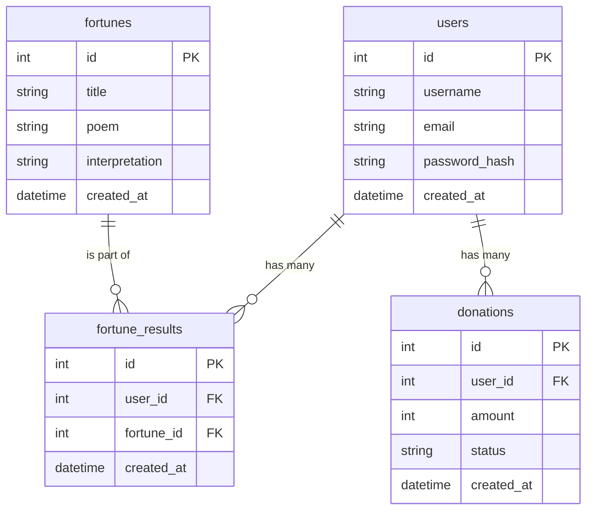

# DB Design Document (資料庫設計文件)

本文件依據核心功能需求 (`docs/PRD.md`) 與流程圖 (`docs/FLOWCHART.md`) 設計了線上算命系統的資料庫架構。本專案將採用 SQLite 作為資料庫儲存，並使用 SQLAlchemy 作為 ORM 框架。

## 1. ER 圖

## 2. 資料表詳細說明

### `users` (使用者表)
紀錄註冊使用者的基本資料。
- `id` (INTEGER): Primary Key，自動遞增。
- `username` (TEXT): 使用者名稱，必填且不可重複。
- `email` (TEXT): 電子信箱，必填且不可重複。
- `password_hash` (TEXT): 加密後的密碼，必填。
- `created_at` (DATETIME): 建立時間，預設為當下時間。

### `fortunes` (籤詩資料表)
存放系統內建的籤詩與解析內容。
- `id` (INTEGER): Primary Key，自動遞增。
- `title` (TEXT): 籤詩標題 (例如：第一籤 甲子)。
- `poem` (TEXT): 籤詩內文。
- `interpretation` (TEXT): 籤詩解析或吉凶意義。
- `created_at` (DATETIME): 建立時間。

### `fortune_results` (算命紀錄表)
紀錄哪位使用者在什麼時間抽到了哪一支籤。
- `id` (INTEGER): Primary Key，自動遞增。
- `user_id` (INTEGER): Foreign Key，關聯至 `users.id`，必填。
- `fortune_id` (INTEGER): Foreign Key，關聯至 `fortunes.id`，必填。
- `created_at` (DATETIME): 抽籤/儲存的時間，預設為當下時間。

### `donations` (捐獻香油錢紀錄表)
紀錄使用者在系統上的香油錢捐獻明細。
- `id` (INTEGER): Primary Key，自動遞增。
- `user_id` (INTEGER): Foreign Key，關聯至 `users.id`，必填。
- `amount` (INTEGER): 捐獻金額，必填。
- `status` (TEXT): 交易狀態 (例如：pending, completed, failed)，必填。預設為 `pending`。
- `created_at` (DATETIME): 捐獻發生時間，預設為當下時間。

## 3. SQL 建表語法
完整的 CREATE TABLE SQL 語法已經儲存在專案的 `database/schema.sql` 檔案中。若未使用 SQLAlchemy `.create_all()` 功能，可直接匯入此檔案進行資料庫初始化。

## 4. Python Model 程式碼
根據 `docs/ARCHITECTURE.md` 的規劃，所有 Python Model 程式碼已放入 `app/models/` 目錄中。
1. `app/models/user.py`
2. `app/models/fortune.py` (包含 Fortune 與 FortuneResult)
3. `app/models/donation.py`
均已實作通用的 CRUD 方法 (create, get_all, get_by_id, update, delete)。
