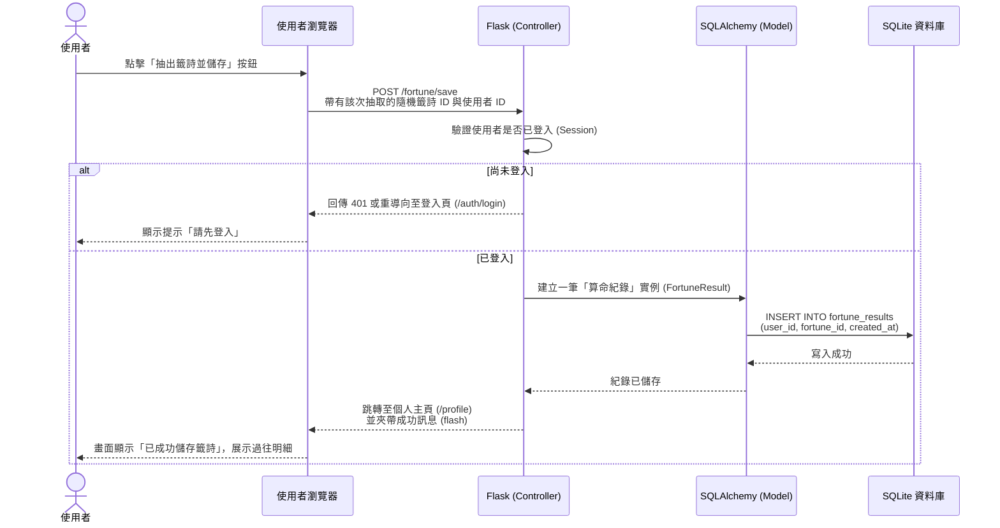

# 系統流程圖文件 (Flowchart)：線上算命系統

本文件依據 `docs/PRD.md` 與 `docs/ARCHITECTURE.md` 的規劃，視覺化「使用者操作路徑」以及「系統核心資料流」。

## 1. 使用者流程圖 (User Flow)

此流程圖展示了使用者進入網站後的主要操作路徑，涵蓋核心的「註冊登入」、「抽籤擲筊流程」、「儲存並分享」、以及「捐獻香油錢」等功能。

```mermaid
flowchart LR
    A([進入線上算命網站]) --> B[網站首頁]
    
    B --> C{是否已登入？}
    C -->|否| D[登入 / 註冊頁面]
    D --> B
    
    B -->|點擊求籤| E[進入抽籤/擲筊頁面]
    C -->|是| E
    
    E --> F[進行擲筊互動]
    F --> G{是否出現聖筊？}
    G -->|否 (笑筊/陰筊)| F
    G -->|是| H[抽出籤詩與顯示解析]
    
    H --> I[點擊「儲存結果」]
    H --> J[點擊「分享至社群」]
    J --> J1([產生圖片或連結並離開])
    
    B -->|點擊個人中心| K[個人主頁頁面]
    K --> L[查看過往算命紀錄]
    K --> M[進入捐獻香油錢頁面]
    M --> N[完成捐獻獲得電子感謝狀]
    N --> K
```

## 2. 系統序列圖 (Sequence Diagram)

此序列圖描述核心互動：「使用者成功擲筊抽出籤詩，並點擊儲存紀錄至資料庫」的完整技術流程。



## 3. 功能清單對照表

此表格列出本系統將會設計的所有重要功能及其預期對應的 URL 路徑與 HTTP Request 方法，作為下一步 API 與頁面路由設計的基礎。

| 功能模組 | 操作描述 | 預期 URL 路徑 | HTTP 方法 |
| :--- | :--- | :--- | :--- |
| **首頁** | 網站入口與介紹 | `/` | GET |
| **驗證** | 使用者註冊頁面與提交 | `/auth/register` | GET / POST |
| **驗證** | 使用者登入頁面與提交 | `/auth/login` | GET / POST |
| **驗證** | 使用者登出操作 | `/auth/logout` | GET |
| **算命** | 隨機抽取一支籤與擲筊互動 | `/fortune/draw` | GET / POST |
| **算命** | 觀看特定籤詩解析詳情 | `/fortune/<int:fortune_id>` | GET |
| **算命** | 儲存算命紀錄 | `/fortune/<int:fortune_id>/save`| POST |
| **個人化**| 個人主頁 (查看儲存紀錄) | `/profile` | GET |
| **功德** | 捐款香油錢頁面 | `/donate` | GET |
| **功德** | 提交香油錢訂單 (模擬金流) | `/donate/checkout` | POST |
